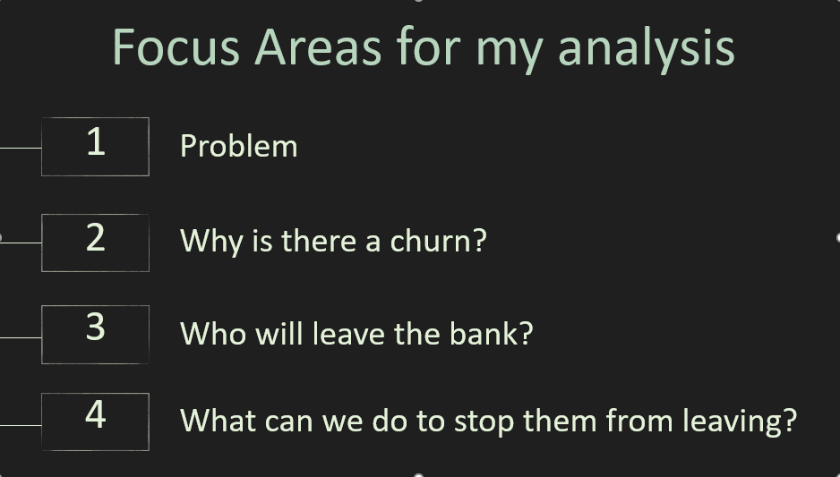
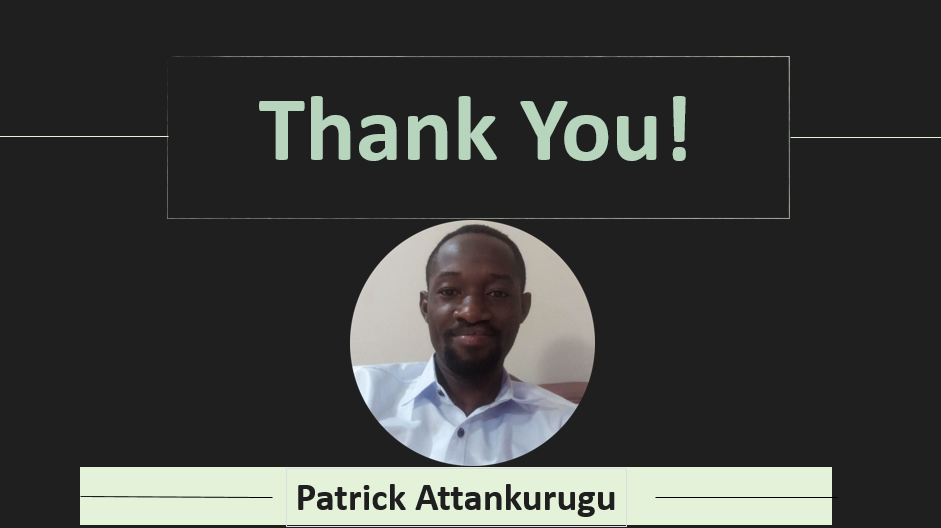

# PROJECT NAME

## CHURN MODELING 2.0: Predictive Modeling With Python And Sci-Kit Learn

## Project Intro/Objectives

The purpose of this project is to predict the likelihood that a particular customer will leave the bank. We are also to find out what exactly the bank should do to keep customers and prevent them from leaving. These are the main objectives, however the bank welcomes any other insights found during analysis.

## Project Description

The data originally belongs to a bank that operates in 3 countries: France, Spain and Germany. But since most of my audience are likely to come from Ghana, I decided to replace the geography variables with Accra, Kumasi and Bolga respectiveloy for easy comprehension. So in the dataset you will see these three Ghanaian regions instead of the countries.
Now the bank has been experiencing a rapid rate of customer churn lately. That means custmers have been leaving the bank at an unusual rate and managemnent want to find out what is wrong, and what they can do to keep their customers. I completed the prototype of this project with a software tool called Gretl. But here, I will be using Python and related libraries.
This project is an application of the logistic regression algorithm. We are trying to compute the binary outcome of whether or not a particular customer will leave the bank.

I used a machine learning library called Sci-kit Learn. But Sci-kit Learn is built on top of matplotlib which in turn is built on top of Numpy. So you need some experience with Numpy, matplotlib and sci-kit learn. You will also need some introductory knowledge in pandas to get started with this project.

## Methods I am using
* Predictive Modeling
* Inferential Statistics
* Machine Learning 

## Technologies I am using
* Python
* Pandas
* Matplotlib
* Sci-Kit Learn
* Numpy
* Jupyter
* Flask
* Posgres
* MySQL
* HTML

### Vision
This is version 2 of the churn modeling project. The vision is to predict the likelihood that a customer will leave the bank and determine what to do to keep them and reduce churn rate drastically.

### About The Data

Data Source: https://www.superdatascience.com/training/pages . (section 5)

* Number of rows in train data: 10,000
* Number of rows in test data: 1,000
* Number of columns: 13

## PROJECT STATUS: Work in progress

## Project needs

* frontend developers
* data exploration/descriptive statistics
* statistical modeling 
* writeup/reporting

### Outcome 
The code is supposed to predict the likelihood that a particular customer or group of customers will leave the bank.

## Getting Started

1. Clone this repo. Enter the command: '$ git clone https://github.com/PatrickAttankurugu/Churn-Modeling-V2-' . Now enter this command: ' $ cd Churn-Modeling-V2-' . To point your command line to the working directory

2. Prepared Data is being kept [here](Prepared_Data) within this repo.
3. Data processing/transformation scripts are being kept [here](Transformations) 
4. All scripts used in the analysis is kept [here](Analysis).
5. My findings and insights are being kept [here](Insights) within this repo.
6. Scripts related to the flask server is being kept [here](Flask). 

## ACKNOWLEDGEMENT
Thanks to [Yvette Kondoh](https://www.linkedin.com/in/yvettekondoh/) for being my mentor

Copyright © [2020] Patrick Attankurugu, University of Ghana. Licensed under the [MIT License](LICENSE)
